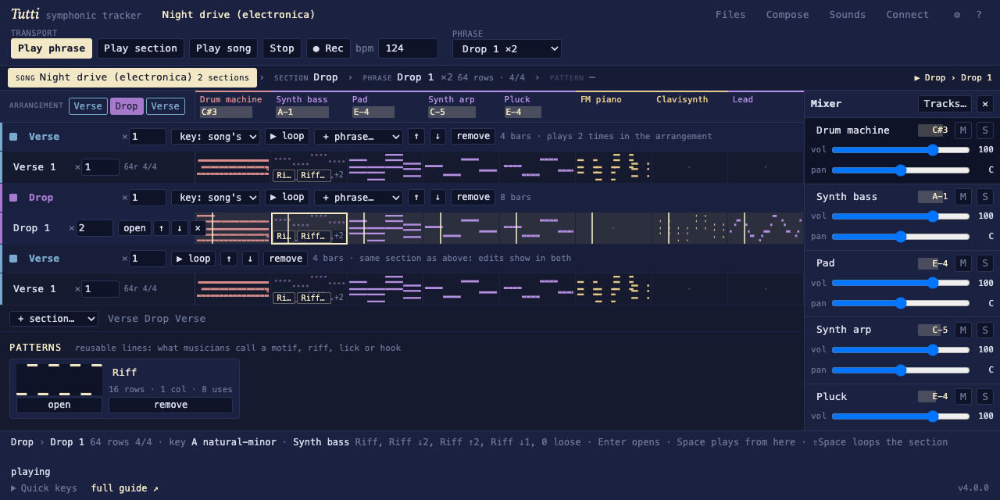
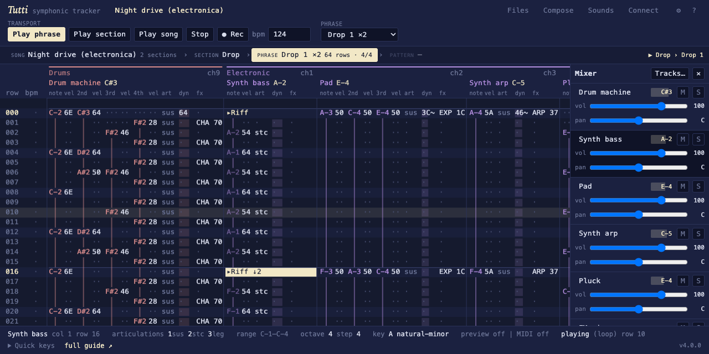

# Tutti — symphonic tracker

A browser-based tracker for composing orchestral music, with MIDI export. Plain ES modules, no build step, no runtime dependencies.

**Live:** https://ajturner.github.io/tutti-music/ · **Guide:** https://ajturner.github.io/tutti-music/help.html

## How a song is built

A song is arranged from **sections** (intro, verse, chorus, bridge; A and B; exposition, coda). A section is made of **phrases**, a few bars for every instrument, which is what the grid shows. The ideas inside a phrase are **patterns**, one voice's reusable line (a motif, riff, lick or hook), **placed** on instruments with transformations: transpose, shift in the key, octave, dynamics, repeat.

- **Song view:** the whole piece at a glance. Sections in playing order, their phrases, and for every phrase a thumbnail of what each instrument plays with a chip per placed pattern. The arrangement is edited here and the song's patterns are listed underneath.
- **The map:** a bar reading Song › Section › Phrase › Pattern with the current level lit. Enter goes in a level, the backquote key comes back out, every crumb is a button.
- **Monitor:** while playing, the note each instrument is sounding shows in the grid header, the Song view and the mixer.





The vocabulary, the file format (version 4) and worked songs are in [docs/domain.md](docs/domain.md); what comes next is in [docs/roadmap.md](docs/roadmap.md).

## Input

- **Keyboard:** piano-layout letters, arrows, and the shortcuts listed under "Keys and MIDI setup" in the app.
- **Touch:** tap to place the cursor, drag to scroll, long-press to clear. An on-screen pad appears on touch screens (or tick *entry pad* in ⚙ View).
- **Game controller:** Bluetooth or USB gamepad, LSDJ-style. D-pad moves, A + d-pad edits, B clears, Start plays. Works on iPhone and iPad.
- **Selection and batch edits:** Shift+arrows or mouse drag select a block. Copy, cut, paste, duplicate, clear, transpose, velocity, note length, articulation, and linear ramps from the toolbar or keyboard.
- **Key and scale:** set the song's key; the pad dims out-of-scale notes, selections transpose by scale degree, controller nudges follow the scale.
- **FX column:** one command per row per instrument: CHA chance, RET retrigger, DEL delay, ARP arpeggio, TSP transpose.
- **Groove:** per-phrase swing presets or a custom cycle of row-length multipliers.
- **Live:** a phrase loops what is written in it, to the end of the last bar with notes, and grows as you write; edits are heard next time round; solo instruments with shift-click or long press; pick another phrase while one loops to queue it; Loop section loops a whole section; in the Song view Play goes forward from the cursor through every repeat.
- **Patterns:** select rows on one instrument and Make pattern; place it anywhere and transform the placement with the keys that move notes (− = transpose, , . shift by scale degree, ⇧− ⇧= octave, < > softer or louder, [ ] repeat). Edit the pattern once with Enter and every placement follows; Detach to vary one copy. A looping bass or beat is one placement with a repeat, in plain sight.
- **Pocket view:** tick it in ⚙ View (or `?pocket`) and the app becomes one phone screen in the image of the M8: the five levels on a line (SO SE PH PA IN), the level itself, a readout of what every instrument sounds, and an on-screen pad with the controller's eight buttons driving the same scheme (A + direction edits, B clears, Back modifies, Start plays). Same song, cursor and undo as the full view.
- **Workflow panels:** the header keeps only the transport and phrase selector; Files, Instruments (the players of the song: their sounds, mix, tuning and articulations, with the sound browser and banks), Connect (MIDI, controller) and ⚙ View open one at a time under it, the settings of the song, a section or the phrase open from the ▾ beside its name in the map, and become full screens behind a tab bar on a phone.
- **Mixer sidebar:** volume, pan, mute and solo per instrument beside the grid while editing.
- **Instruments made from sounds:** an instrument is a player in the song with its own name, channel, columns, volume and pan (CC7 and CC10), mute and solo, and its own tune, cents, trim and release, all saved in the song. ⧉ makes another from the same sound, so two fiddles can sit a few cents apart, left and right; the samples load once.
- **Sections and arrangement:** add, name, repeat, reorder and key sections in the Song view; reuse a phrase in another section or play a section again; the .mid gets a marker per section (song format 4).
- **Shaping and variation:** EXP fx command for per-note swell, sfz, fade in and out; Fill, Rnd vel, Rnd pitch and Humanize on selections.
- **Nested keys, live record, full undo:** a phrase's key over its section's over the song's; ⇧Return records played MIDI onto the passing row; undo covers instruments, mixer, keys, sections, the arrangement, tempo and title.
- **Sound banks:** the Symphony orchestra (loaded by default) plus bundled Jazz combo, Folk group and Electronica banks, or any bank.json URL; add whole banks or single instruments; songs remember their banks. `npm run build:banks` regenerates them.
- **Sampled orchestra:** VSCO 2 (CC0) multisamples with articulations and dynamic layers in `banks/orchestra/`, synth fallback; regenerate with `npm run build:samples`.
- **Installable and offline:** web manifest, icons and a service worker; add to home screen, and previously played samples work without a network.
- **Autosave:** songs persist in the browser and the URL names the open song and phrase, so a refresh or bookmark reopens it. Delete resets an example or removes your song.
- **MIDI in:** step-record from a keyboard into the cursor cell, with chords spread across note columns. Chromium browsers only.

## Run locally

```sh
npm start
```

Then open http://localhost:3000/. The app is ES modules, so it needs a server; opening `index.html` from disk does not work.

## Layout

- `index.html`, `styles.css`: markup and styles.
- `src/core/`: the UI-free core (song model, instruments, render, scheduler, preview synth, MIDI out, MIDI file writer, examples). It runs under Node and could back a native app.
- `src/ui/`: the browser tracker (state, layout, editing, selection, keyboard, pointer, drawing, gamepad, pad, MIDI in, toolbar). `src/main.js` wires it and exposes the API as `window.tutti`.
- `schema/`: JSON Schema (draft 2020-12) for the song file and instrument definitions. Saved songs reference the song schema by URL.
- `openspec/`: behaviour specs.
- `test/`: Node tests for the core and schemas, Playwright tests for the UI.

## Development

- **Specs:** behaviour is documented with [OpenSpec](https://github.com/Fission-AI/OpenSpec) under `openspec/specs/`, one capability per folder. Propose changes with `/opsx:propose` in Claude Code, or run `openspec validate --all --strict`.
- **Tests:** `npm install` once, then `npm test` runs the core and schema tests under Node, the site build tests (`test/pages.test.mjs`) and the Playwright browser tests (`test/ui.test.mjs`) at desktop and phone sizes, including mocked gamepad and MIDI input. Uses installed Google Chrome by default; set `TUTTI_BROWSER=chromium` to use Playwright's own build.

## Builds and previews

The Pages workflow (`.github/workflows/pages.yml`, `scripts/build-pages.mjs`) publishes three things on every push to `main` and every pull request event:

- the live app from `main` at the site root, exactly as before;
- a preview of every open pull request under `pr/<number>/`;
- a listing at **[builds/](https://ajturner.github.io/tutti-music/builds/)**: main, then each open pull request with what the change is for (from its description), a link to view its build and a link to the pull request. The app's footer links to it.

A preview runs on the same origin as the live app, so the build makes three preview-only changes: saved songs and settings are kept under a `pr<number>:` prefix, no service worker is registered (and the live app's worker leaves `pr/` and `builds/` to the network) so a reload always shows the latest push, and samples are fetched from the live site unless the pull request changes `banks/` (which keeps a preview at about 1 MB). A bar across the top names the pull request and links back to it and to the listing. Nothing from a pull request is executed by the workflow, and pull requests from forks are listed without a preview. Try it locally:

```sh
gh pr list --state open --json number,title,body,author,headRefName,headRefOid,baseRefName,isDraft,isCrossRepository,url,updatedAt,additions,deletions,changedFiles,reviewDecision,labels > /tmp/prs.json
node scripts/build-pages.mjs --out /tmp/site --prs /tmp/prs.json --repo ajturner/tutti-music
npx serve /tmp/site
```
