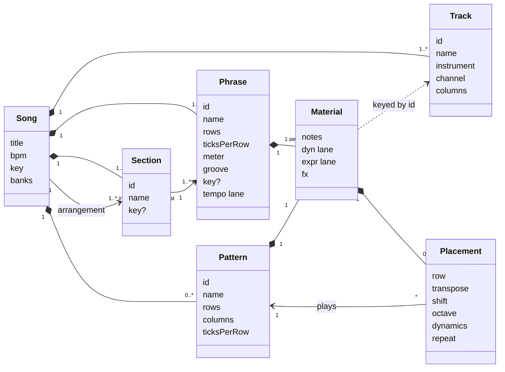
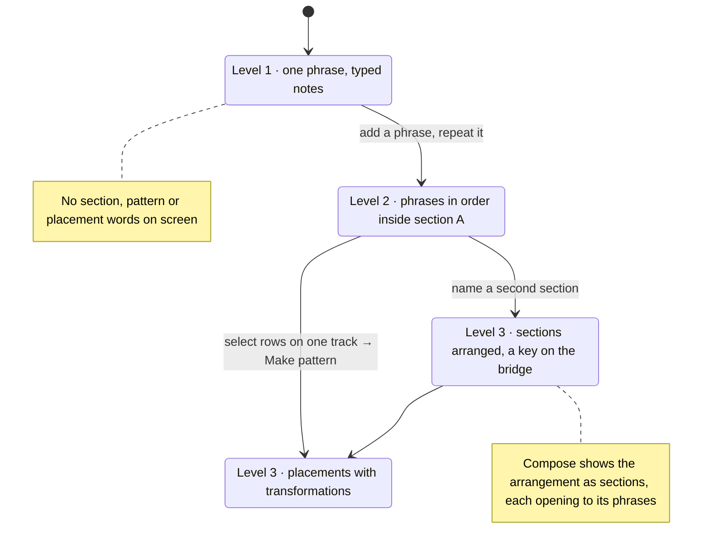

# Tutti domain model, format 4 (proposed)

**Status: proposed.** The app at 3.0.x still implements [domain.md](domain.md), where *pattern* means the multi-track block, *phrase* the reusable line, and a track can *follow* another pattern. This document replaces it when format 4 ships. Nothing here is built yet.

The aim is a song you can read top to bottom in the words musicians already use: a song is arranged from sections, a section is made of phrases, a phrase is a few bars for every instrument, and the ideas inside it are patterns placed on tracks.

## Vocabulary

| Term | Meaning | What musicians call it | Lives in |
|---|---|---|---|
| **Song** | The whole piece: tracks, patterns, phrases, sections, arrangement, tempo, key, banks. | work, tune, song | file |
| **Track** | One instrument with a MIDI channel and 1 to 4 note columns. Constant across the song. | instrument, player, staff | song.tracks |
| **Arrangement** | The sections in playing order, each with a repeat. | form: AABA, verse–chorus, sonata | song.arrangement |
| **Section** | A named span of the song made of phrases in order, each with a repeat; may carry its own key. | intro, verse, chorus, bridge, outro; A section, B section, head; exposition, development, coda; a movement | song.sections |
| **Phrase** | A few bars for every track: rows, row size, meter, tempo lane, groove, and material per track. The unit the grid shows. | phrase; a line of the verse; four or eight bars | song.phrases |
| **Material** | What one track holds inside a phrase: loose notes, lanes, fx and placements. Also the shape a pattern holds, without placements. | the instrument's part for those bars | phrase.material[track], pattern.material |
| **Pattern** | A reusable line of notes for one voice, written once: notes, articulation, its own lanes and fx. | motif, riff, lick, figure, ostinato, hook, fill | song.patterns |
| **Placement** | One use of a pattern: on a track of a phrase, at a row, with its transformations. Editing the pattern changes every placement. | a statement of the motif; the riff again, a fourth up | material.placements |
| **Transformation** | How a placement changes the pattern it plays: transpose (semitones), shift (scale degrees), octave, dynamics (louder or softer), repeat. | transposition, sequence, octave displacement, dynamic marking | placement fields |
| **Modulation** | A section or phrase taking its own key. Never a property of a placement. | modulation | section.key, phrase.key |
| **Note**, **Lane**, **Bank**, **Render** | Unchanged from format 3. | | |

Verbs: **place** a pattern, **detach** a placement, **transform** a placement, **arrange** sections, a section or phrase **repeats**, a section **modulates**, a song **renders**.

Words not used: *follows*, *chain*, *entry*, *motif* on any label (the guide may gloss it), *clip*, *block*, *scene*, *part*, *order*, *event* for stored notes.

## What changed from format 3, and why

| Format 3 | Format 4 | Why |
|---|---|---|
| pattern (multi-track block) | **phrase** | Every tradition calls a few bars for the whole ensemble a phrase. |
| phrase (reusable line) | **pattern** | Everyday use already means one repeated line: a drum pattern, a bass pattern. Approachable without theory. |
| arrangement of entries | **arrangement of sections**, sections of phrases | Songs are talked about in sections. Format 3 had no word for them. |
| follows | **removed** | A hidden substitution you could not see in the grid, silent when looping a pattern, locked to the same track. A placement with a repeat inside the phrase does the same job in plain sight. |
| key on song and pattern | key on song, **section**, phrase | The bridge modulates. That is where musicians expect a key change. |
| placement: transpose, repeat | placement: transpose, **shift**, **octave**, **dynamics**, repeat | "The horns state it a fifth higher, piano" is one placement. |

The grid is unchanged in spirit: you still edit a multi-track block of rows (now a phrase), and Enter on a tag still opens the reusable line alone (now a pattern).

## For M8 users

| M8 | Tutti format 4 |
|---|---|
| song row | a phrase, in the order its section lists it |
| section (consecutive rows) | **section** |
| cell: the chain a track plays on a row | the track's column of placements inside that phrase |
| chain | the placements of one track in one phrase, read top to bottom |
| chain step: phrase + transpose | **placement**: pattern + transformations |
| phrase | **pattern** |
| instrument per step | the track's instrument |

A placement is one **step** of a chain, not the chain. The chain itself has no word in Tutti because it is not an object: it is simply what you see when you read one track down one phrase. Three differences from an M8 chain follow from that. It is not reusable on its own; you reuse patterns, phrases and sections instead. Its steps sit at rows, so they may leave gaps and share the track with loose notes. And every track in a phrase has the same length, so tracks cannot drift against each other.

## Structure



Rules that keep it consistent:

1. **Reuse happens at three levels and nowhere else.** A pattern is placed many times. A phrase may appear in more than one section. A section may appear more than once in the arrangement.
2. **A placement never copies.** Detach is the only way to get loose notes out of a pattern.
3. **A pattern belongs to a kind of voice, not a track.** Any track can place it; columns beyond the track's are dropped at render time.
4. **Only a phrase owns time.** Rows, meter, tempo lane and groove. Patterns inherit them where they are placed.
5. **Keys nest.** Phrase over section over song. A placement's shift uses the key in force where it sounds.
6. **Everything a track plays in a phrase is visible in that phrase.** There is no reference from one phrase to another.

## File format, version 4

```json
{
  "$schema": "https://ajturner.github.io/tutti-music/schema/tutti-song.schema.json",
  "format": "tutti-song", "version": 4, "uid": "c1f0…",
  "title": "Blue room", "notes": "", "bpm": 132, "key": { "root": 5, "scale": "major" },
  "banks": ["jazz"],
  "tracks": [
    { "id": "sax", "name": "Tenor sax", "instrument": "tenor-sax", "channel": 1, "columns": 1, "mute": false },
    { "id": "bass", "name": "Upright bass", "instrument": "upright-bass", "channel": 2, "columns": 1, "mute": false },
    { "id": "kit", "name": "Drum kit", "instrument": "drum-kit", "channel": 10, "columns": 2, "mute": false }
  ],
  "patterns": [
    { "id": "riff", "name": "Riff", "rows": 16, "ticksPerRow": 240, "columns": 1,
      "material": { "notes": [{ "col": 0, "tick": 0, "pitch": 65, "vel": 96, "len": 480, "art": "sus" }], "dyn": [], "expr": [], "fx": [] } },
    { "id": "walk", "name": "Walk", "rows": 16, "ticksPerRow": 240, "columns": 1,
      "material": { "notes": [{ "col": 0, "tick": 0, "pitch": 41, "vel": 90, "len": 960, "art": "sus" }], "dyn": [], "expr": [], "fx": [] } },
    { "id": "ride", "name": "Ride", "rows": 16, "ticksPerRow": 240, "columns": 2,
      "material": { "notes": [{ "col": 0, "tick": 0, "pitch": 51, "vel": 80, "len": 240, "art": "hit" }], "dyn": [], "expr": [], "fx": [] } }
  ],
  "phrases": [
    { "id": "a1", "name": "A", "rows": 64, "ticksPerRow": 240, "meter": [4, 4], "groove": [1.33, 0.67], "key": null, "tempo": [],
      "material": {
        "sax":  { "notes": [], "dyn": [], "expr": [], "fx": [], "placements": [{ "pattern": "riff", "row": 0, "repeat": 2 }, { "pattern": "riff", "row": 32, "shift": 3, "repeat": 2 }] },
        "bass": { "notes": [], "dyn": [], "expr": [], "fx": [], "placements": [{ "pattern": "walk", "row": 0, "repeat": 2 }, { "pattern": "walk", "row": 32, "transpose": 5, "repeat": 2 }] },
        "kit":  { "notes": [], "dyn": [], "expr": [], "fx": [], "placements": [{ "pattern": "ride", "row": 0, "repeat": 4 }] }
      } },
    { "id": "b1", "name": "Bridge", "rows": 64, "ticksPerRow": 240, "meter": [4, 4], "groove": [1.33, 0.67], "key": null, "tempo": [],
      "material": {
        "sax":  { "notes": [{ "col": 0, "tick": 0, "pitch": 70, "vel": 100, "len": 1920, "art": "sus" }], "dyn": [], "expr": [], "fx": [], "placements": [] },
        "bass": { "notes": [], "dyn": [], "expr": [], "fx": [], "placements": [{ "pattern": "walk", "row": 0, "transpose": 5, "repeat": 4 }] },
        "kit":  { "notes": [], "dyn": [], "expr": [], "fx": [], "placements": [{ "pattern": "ride", "row": 0, "dynamics": -16, "repeat": 4 }] }
      } }
  ],
  "sections": [
    { "id": "A", "name": "A", "key": null, "phrases": [{ "phrase": "a1", "repeat": 2 }] },
    { "id": "B", "name": "Bridge", "key": { "root": 10, "scale": "major" }, "phrases": [{ "phrase": "b1", "repeat": 2 }] }
  ],
  "arrangement": [
    { "section": "A", "repeat": 2 }, { "section": "B", "repeat": 1 }, { "section": "A", "repeat": 1 }
  ]
}
```

Reading it back: the tune is A A B A. Each A is the eight-bar phrase twice. In it the sax states the riff twice, then twice more three scale steps up; the bass walks under it and moves up a fourth for the second half; the ride pattern runs four times. The bridge section is in B♭, the sax plays loose long notes, and the ride is placed softer. Everything a track plays is in the phrase you are looking at.

Loader rules, in order: a song needs tracks, phrases, sections and an arrangement; a missing section list becomes one section "A" holding every phrase in order; a missing arrangement plays every section once; references to a missing pattern, phrase or section are dropped; placement fields default to transpose 0, shift 0, octave 0, dynamics 0, repeat 1 and are clamped; versions below 4 are refused with a message naming the version.

## Three songs

**A jazz tune, AABA.** The file above. What you learn by building it: form, a riff treated in sequence, a bridge that modulates.

**A pop song.** Arrangement: Intro, Verse, Chorus, Verse, Chorus, Bridge, Chorus ×2, Outro. Patterns: *Hook*, *Bass line*, *Beat*, *Fill*. The Chorus section is one phrase where the lead places *Hook* and the drums place *Beat* ×3 then *Fill*. The Verse phrase places *Beat* ×4 with dynamics down and leaves the lead as loose notes, because verses change words and shape. The last chorus is the same section with repeat 2. What you learn: that a song is mostly the same few ideas, and that contrast comes from who plays and how loud.

**A symphonic movement.** Arrangement: Exposition, Development, Recapitulation, Coda. Patterns: *First theme*, *Second theme*, *Ostinato*. The exposition's phrases place *First theme* on Violins I and *Ostinato* on Violas ×4. The development is in the dominant and places *First theme* on Horns with octave −1, then on Oboe with shift +2, then again with shift +4: a sequence, visible as three tags. The recapitulation reuses the exposition's phrases by reference. What you learn: development is restating an idea through transformations and keys.

**Level 1, unchanged for a beginner.** A new song is one section "A" holding one phrase "A". You type notes. You never meet the words pattern, placement or section until you add one.

## How the levels unfold in the UI



## What the app would change

- **Header.** The selector lists phrases grouped by section. Play phrase, Play section, Play song.
- **Compose.** Arrangement becomes a strip of section chips with repeats; a section opens to its phrase chips with repeats; each has name and key. The entry dialog and ⛓ badge go away. The phrases group is renamed patterns.
- **Grid.** Tags read the pattern name and its transformations: `▸Riff ↑3 ×2`, `▸Ride pp ×4`. New keys on a tag: `,` `.` shift, `⇧[` `⇧]` octave, a dynamics nudge.
- **Core.** Rename through temporary names so the two swapped words never coexist half-done; remove `follows` and `materialFor`'s loop-and-clip; add sections and the nested arrangement walk; add shift, octave and dynamics to placement expansion.
- **Format.** Version 4, a clean break like version 3.
- **Roadmap.** Paused phases adjust: key per entry becomes key per section, which is already here; placement shift is already here; the chord lane belongs to a phrase.

## Open questions

1. **Placement or statement** for one use of a pattern. Placement is recommended: it matches "place a pattern" and needs no theory.
2. **Does a section need its own tempo**, or is the phrase's tempo lane enough? Recommended: phrase only, to keep one owner of time.
3. **Phrase names.** With sections carrying the meaningful names, phrases could default to "A1", "A2" inside section A.
