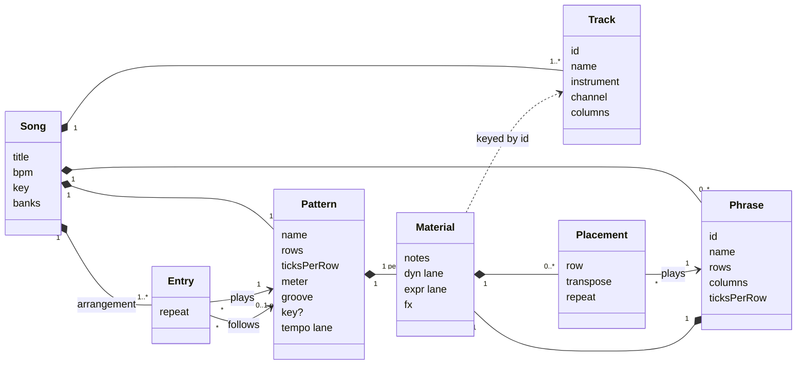
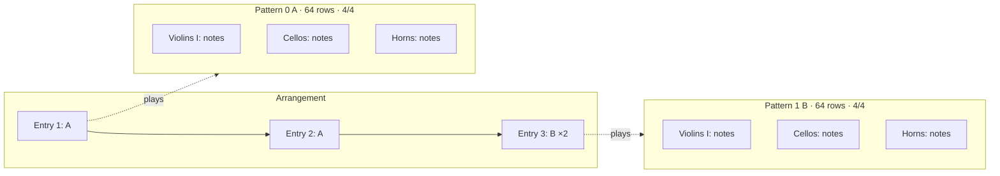
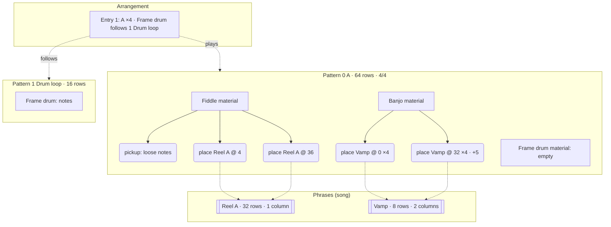
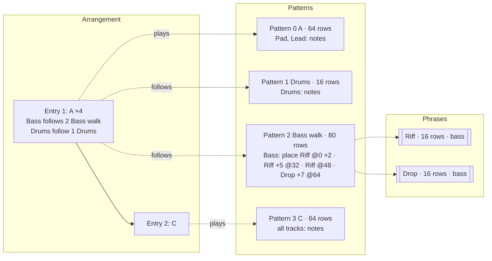
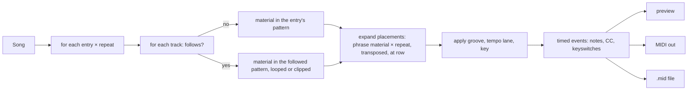
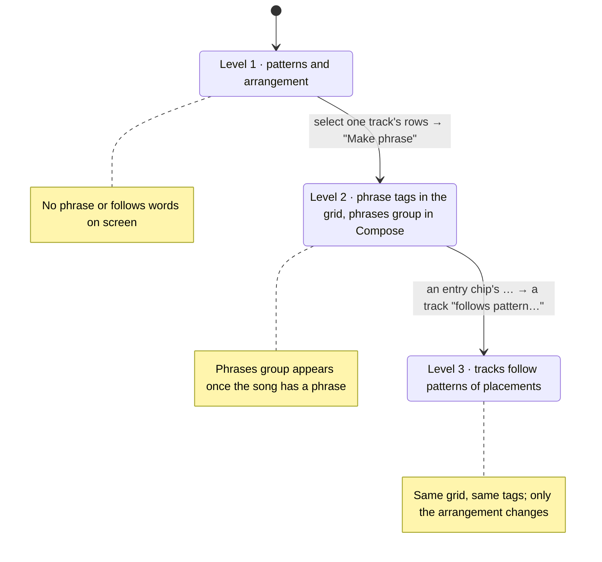

# Tutti domain model

> **A revision is proposed in [domain-4.md](domain-4.md):** sections arranged into a song, phrases as the multi-track block, patterns as the reusable line, and no follows. This document describes what 3.0.x implements.

The vocabulary the app, the specs, the file format and the guide all use. One word per concept, one home per concept, and the JSON field is the same word as the label on screen. Format version 3 is the first to follow this document; earlier files are not read (no songs were saved with them).

## Ubiquitous language

| Term | Meaning | Lives in | Identity |
|---|---|---|---|
| **Song** | The whole piece: tracks, patterns, phrases, arrangement, tempo, key, banks. The aggregate root; every edit goes through it. | file | title + `uid` |
| **Track** | One instrument voice with a MIDI channel and 1 to 4 note columns. Tracks are the columns of every pattern. | song.tracks | `id` |
| **Pattern** | A block of rows across *all* tracks with its own length, row size, meter, tempo lane, groove and optional key. The unit the grid shows, the arrangement plays, and a track can follow. | song.patterns | index + name (`0 A`) |
| **Material** | Notes, lanes and fx for one track over some rows. The one shape both a pattern (per track) and a phrase hold. | pattern.material[track], phrase.material | none (value) |
| **Note** | A pitch at a tick in a note column with velocity, length and articulation. | material.notes | none (value) |
| **Lane** | A stepped or ramped controller line: dynamics (`dyn`) and expression (`expr`) per track, `tempo` per pattern. | material, pattern | none (value) |
| **Phrase** | Reusable material for one track, a fixed number of rows and columns, kept once in the song. Never arranged, only placed. | song.phrases | `id` + name |
| **Placement** | "Play phrase P here": a reference from a track's material to a phrase at a row, with a transpose and a repeat count. Editing the phrase changes every placement. | material.placements | none (value) |
| **Arrangement** | The list of entries that make the song from start to end. | song.arrangement | none |
| **Entry** | One step of the arrangement: a pattern, a repeat count, and per-track *follows*. | arrangement | position |
| **Follows** | An entry's override for one track: the track takes its material from another pattern instead of the entry's, looped or clipped to the entry's length. | entry.follows[track] | none (value) |
| **Bank** | A set of sampled or synthesised instruments a song can name and load. | song.banks | `id` |
| **Render** | Turning the arrangement into timed events (notes, controllers, keyswitches) for playback, MIDI out and file export. | core | none (pure) |

Verbs, used the same way everywhere: **place** a phrase, **detach** a placement into loose notes, **transpose** a placement, a track **follows** a pattern, an entry or placement **repeats**, a song **renders**.

Words not used: *chain*, *clip*, *block*, *sequence*, *scene*, *part*, *order*, *event* (for stored notes). If one of these appears in a spec, a label or a field name, it is a mistake to correct. What the M8 calls a chain is, in Tutti, a pattern whose track holds placements in sequence and that another entry's track follows; it needs no word of its own.

## Why these and not more

- **Pattern and phrase are not the same thing.** They share the Material shape and nothing else. A pattern is multi-track, owns time (meter, tempo lane, groove) and is what the grid shows and the arrangement plays. A phrase is single-track, owns no time, and only exists inside placements. Merging them would put every eight-row snippet into the header's pattern selector and give phrases a meter they cannot use.
- **There is no chain.** A sequence of phrases with transposes and repeats for one track is a pattern with placements on that track, and "follows" already loops or clips a pattern to an entry. So the bass in an electronica song follows pattern *Bass walk*, and *Bass walk* is edited in the same grid as everything else. One less noun, one less editor.
- **Follows only names a pattern.** A track never follows a phrase directly; it follows a pattern that places the phrase. This keeps one rule for the renderer and one place to look for what a track is doing.
- **Transpose and repeat sit on the reference, never on the thing.** A placement transposes and repeats; an entry repeats. A phrase and a pattern are what they are.

## File format, version 3

One JSON document per song. Field names are the vocabulary above. Phrases have an `id` because placements name them; tracks have an `id` because material, follows and channels are keyed by track; everything else is addressed by position.

```json
{
  "$schema": "https://ajturner.github.io/tutti-music/schema/tutti-song.schema.json",
  "format": "tutti-song", "version": 3, "uid": "c1f0…",
  "title": "Crossroads reel", "notes": "", "bpm": 112, "key": { "root": 7, "scale": "major" },
  "banks": ["folk"],
  "tracks": [
    { "id": "fid", "name": "Fiddle", "instrument": "fiddle", "channel": 1, "columns": 1, "mute": false, "volume": 100, "pan": 64 },
    { "id": "bjo", "name": "Banjo", "instrument": "banjo", "channel": 2, "columns": 2, "mute": false, "volume": 90, "pan": 40 },
    { "id": "drm", "name": "Frame drum", "instrument": "frame-drum", "channel": 3, "columns": 1, "mute": false }
  ],
  "phrases": [
    { "id": "reelA", "name": "Reel A", "rows": 32, "ticksPerRow": 240, "columns": 1,
      "material": { "notes": [{ "col": 0, "tick": 0, "pitch": 74, "vel": 96, "len": 240, "art": "sus" }], "dyn": [], "expr": [], "fx": [] } },
    { "id": "vamp", "name": "Vamp", "rows": 8, "ticksPerRow": 240, "columns": 2,
      "material": { "notes": [{ "col": 0, "tick": 0, "pitch": 43, "vel": 80, "len": 480, "art": "sus" }, { "col": 1, "tick": 480, "pitch": 55, "vel": 70, "len": 480, "art": "sus" }], "dyn": [], "expr": [], "fx": [] } }
  ],
  "patterns": [
    { "name": "A", "rows": 64, "ticksPerRow": 240, "meter": [4, 4], "groove": [], "key": null, "tempo": [],
      "material": {
        "fid": { "notes": [{ "col": 0, "tick": 0, "pitch": 67, "vel": 90, "len": 240, "art": "sus" }], "dyn": [{ "tick": 0, "value": 48 }], "expr": [], "fx": [],
                 "placements": [{ "phrase": "reelA", "row": 4, "transpose": 0, "repeat": 1 }, { "phrase": "reelA", "row": 36, "transpose": 0, "repeat": 1 }] },
        "bjo": { "notes": [], "dyn": [], "expr": [], "fx": [],
                 "placements": [{ "phrase": "vamp", "row": 0, "transpose": 0, "repeat": 4 }, { "phrase": "vamp", "row": 32, "transpose": 5, "repeat": 4 }] }
      } },
    { "name": "Drum loop", "rows": 16, "ticksPerRow": 240, "meter": [4, 4], "groove": [], "key": null, "tempo": [],
      "material": {
        "drm": { "notes": [{ "col": 0, "tick": 0, "pitch": 60, "vel": 100, "len": 240, "art": "hit" }, { "col": 0, "tick": 1920, "pitch": 60, "vel": 80, "len": 240, "art": "hit" }], "dyn": [], "expr": [], "fx": [], "placements": [] }
      } }
  ],
  "arrangement": [
    { "pattern": 0, "repeat": 4, "follows": { "drm": 1 } }
  ]
}
```

Reading it back: the Fiddle plays a pickup note, then *Reel A* twice; the Banjo plays *Vamp* four times and then four times a fourth up; the Frame drum follows pattern 1 *Drum loop*, which repeats sixteen times across the entry's 256 rows. Everything named exists.

Rules the loader enforces, in this order:

1. A song needs `tracks`, `patterns` and `arrangement`; each pattern's `material` and each phrase's `material` are filled with empty lists where absent.
2. An entry naming a missing pattern is dropped; an arrangement left empty gets entry `{ pattern: 0 }`.
3. A follows naming the entry's own pattern or a missing pattern is removed. A follows names a pattern index and nothing else.
4. A placement naming a missing phrase is removed. `transpose` defaults to 0 and `repeat` to 1.
5. A placement whose phrase has more columns than the track keeps its data; the extra columns are dropped at render time with a status warning. Fewer columns leave the track's other columns free for loose notes.
6. A phrase's `ticksPerRow` may differ from the placing pattern's; ticks are scaled, as they are for a followed pattern.

What changes from version 2, all deliberate: `order` → `arrangement`, entry `tracks` → `follows` (values are pattern indices), pattern `tracks` → `material`, `events` → `notes`, plus the new `phrases` and `placements`. Version 1 and 2 files are refused with a message naming the version; the built-in examples are code and move with the app.

## Structure



Three rules keep the model consistent:

1. **A phrase belongs to a track kind, not a track.** It carries material for one voice; any track can place it. Articulations the placing track's instrument lacks fall back at render time, exactly as when a track changes instrument.
2. **A placement never copies.** Detaching is the only way to turn a placement into loose notes, and it is explicit.
3. **Follows is the only cross-pattern reference in the arrangement, and it only names a pattern.** Phrases are reached through placements, never from an entry.

## Three songs

### Level 1: Sketch in C, patterns only

Two patterns, every track written in each. The arrangement plays them. No phrase, no follows, and neither word appears in the UI.



### Level 2: Crossroads reel, phrases inside a pattern

The JSON above. The fiddle's tune is one phrase placed twice; the banjo vamp is an 8-row phrase placed with repeat 4, then again a fourth up. Loose notes still exist: the fiddle's pickup is typed directly. The frame drum follows a 16-row pattern.



What the user sees: a tag at rows 4 and 36 of the Fiddle track reading `Reel A`, one tag on the Banjo at row 0 reading `Vamp ×4` and one at row 32 reading `Vamp +5 ×4`, and a **phrases** group in Compose listing `Reel A (2 uses)` and `Vamp (2 uses)`. Enter on a tag opens the phrase; changing one note of the vamp changes all eight bars.

### Level 3: Night drive, a track follows a pattern of placements

Pads and lead sit in one long pattern. The bass has its own life: it follows pattern 2 *Bass walk*, a pattern whose only material is four placements on the Bass track. The drums follow a 16-row pattern. Only the tracks that need independence leave pattern A.



The rows the renderer produces for entry 1 (256 rows). Each track fills them independently:

| rows | Pad, Lead (pattern A) | Bass (follows Bass walk) | Drums (follows Drums) |
|---|---|---|---|
| 0–15 | A, rows 0–15 | Riff | Drums |
| 16–31 | A, rows 16–31 | Riff | Drums |
| 32–47 | A, rows 32–47 | Riff +5 | Drums |
| 48–63 | A, rows 48–63 | Riff | Drums |
| 64–79 | A again, rows 0–15 | Drop +7 | Drums |
| 80–95 | A, rows 16–31 | Riff (Bass walk loops) | Drums |
| … | … | … | … |
| 240–255 | A, rows 48–63 | Drop +7 | Drums |

A followed pattern shorter than the entry loops; longer is clipped. That is the rule follows has always had, so *Bass walk* is nothing special to the renderer: a pattern with placements, looped.

## Rendering

Every playback path goes through the same expansion, so MIDI export, the sampler and the synth cannot disagree.



## How the levels unfold in the UI



## Workflows

Each workflow is written in the vocabulary above, as the guide will describe it. Steps name the panel or key; the last line says what the song contains afterwards.

### 1. A string quartet sketch (patterns only)

Goal: an eight-bar idea with two sections, written straight into the grid.

1. **Song → New.** Rename it in the header title. Compose → tracks: remove everything but Violins I, Violins II, Violas, Cellos.
2. **Compose → pattern.** Rows 64, row 1/16, meter 4/4. Key C major so scale-degree keys and in-key colouring work.
3. Type the cello line on the grid with step 16 (`⇧=` raises the step), then the inner voices, then the melody on Violins I. Dynamics lane: a ramp from 30 to 60 across the four bars.
4. **Compose → pattern → +** adds pattern 1 B the same size. Change the last two chords.
5. **Compose → arrangement:** `0 0 1 1`, or drag the chips. Play song.
6. **Song → Export .mid** to continue in a DAW, or **Save JSON**.

Afterwards: 4 tracks, 2 patterns, arrangement of 4 entries, no phrases, no follows. Neither word appeared.

### 2. A folk reel (phrases inside a pattern)

Goal: the A part of a reel repeated with a different ending, a banjo vamp underneath, and the ending varied without retyping.

1. Song from the folk bank (Sounds → banks → Folk group, or open the Crossroads reel showcase). Tracks: Fiddle, Banjo (2 columns), Frame drum.
2. Type the fiddle's first 32 rows of tune after a 4-row pickup. Select rows 4 to 35 on Fiddle, **Make phrase** on the selection toolbar, name it *Reel A*. The notes become a placement tagged `Reel A` at row 4.
3. Cursor at row 36, `⌘V`: a second placement of *Reel A*. The status line reads `phrase Reel A, used 2×, Enter edits`.
4. Banjo: type an 8-row vamp, select it, **Make phrase** → *Vamp*. On the tag, `⇧=` raises its repeat to 4: `Vamp ×4` fills rows 0 to 31. `⌘D` duplicates the placement after itself, then `=` five times on the copy: `Vamp +5 ×4`.
5. The ending should differ: cursor on the second *Reel A* tag, **Detach** (selection toolbar). Its rows are loose notes now; change the last four.
6. Fix a wrong note in the tune: Enter on the first tag opens *Reel A* in the grid, edit, Esc. The first placement follows; the detached copy does not, which is what was wanted.
7. Drums: pattern 1 *Drum loop*, 16 rows, typed. Compose → arrangement: chip `0 A` → `…`: repeat 4, Frame drum *follows pattern 1 Drum loop*.
8. Compose → phrases lists *Reel A (1 use)* and *Vamp (2 uses)* with audition and rename.

Afterwards: 2 patterns, 2 phrases, 3 placements, loose notes for the pickup and the ending, one follows.

### 3. An electronica track (a track follows a pattern of placements)

Goal: pads and lead in one 64-row pattern, a bass line that walks through transpositions, drums from a short loop, and a breakdown.

1. Song from the Electronica bank. Tracks: Pad, Lead, Bass, Drum machine.
2. Pattern 0 A, 64 rows: pads and lead. Leave Bass and Drums empty here.
3. Pattern 1 *Drums*, 16 rows: drums only.
4. Pattern 2 *Bass walk*, 80 rows: on the Bass track type 16 rows of riff, **Make phrase** → *Riff*; type 16 rows of drop at row 64, **Make phrase** → *Drop*. Set the first tag's repeat to 2, place *Riff* at 32 with `+5`, place *Riff* at 48, set the *Drop* tag to `+7`.
5. **Compose → arrangement:** chip `0 A` → `…`: repeat 4, Bass *follows pattern 2 Bass walk*, Drums *follows pattern 1 Drums*. Play song. The chip shows `0 A ×4 ⛓`; the grid header marks Bass with `Bass walk` and Drums with `Drums`.
6. Breakdown: pattern 3 C, 64 rows, every track typed. Arrangement `0x4 3`.
7. Change the bass everywhere at once: edit *Riff* from Compose → phrases. Change only bar three: in *Bass walk*, detach the third placement, or place a new phrase there.

Afterwards: 4 patterns, 2 phrases, 4 placements, arrangement of 2 entries, the first with two follows.

### 4. A film cue (tutti, divisi and a changing meter)

Goal: an orchestral cue that moves from 4/4 to 7/8, with an ostinato shared by three sections.

1. Orchestra song, full roster. Compose → tracks: Violins I and Violas to 2 columns for divisi.
2. Pattern 0 A, 4/4, 64 rows: the ostinato on Violas. Select it, **Make phrase** → *Ostinato* (2 columns).
3. Place *Ostinato* on Cellos at row 0 and on Violins II at row 32 with `+12`. A phrase belongs to a track kind, so any string track can place it; Violins II has one column, so the phrase's second column is dropped and the status line says so.
4. Pattern 1 B, meter 7/8, row 1/16, 56 rows, pattern key D minor. Brass chorale typed in; dynamics ramps on each brass track; timpani roll with the `T` fx.
5. Arrangement `0x2 1 0`. The pattern's meter drives the bar lines and the exported time signature.
6. Compose → tracks or the mixer: balance, pan the horns left. Export .mid: one MIDI track per Tutti track, meter changes on the conductor track.

Afterwards: 2 patterns with different meters and keys, 1 phrase with 3 placements, no follows.

### 5. A jazz head (AABA with repeats, walking bass by follows)

Goal: a 32-bar AABA head where A is written once, the bridge is different, and the bass walks under everything.

1. Jazz combo song: Piano (2 columns), Tenor sax, Upright bass, Drum kit.
2. Pattern 0 A, 128 rows (8 bars of 1/16): head on sax, comping on piano, ride on drums. Leave the bass empty.
3. Pattern 1 B, 128 rows: the bridge, all but the bass.
4. Pattern 2 *A bass*, 128 rows: on Upright bass type a 32-row walk over the I chord, **Make phrase** → *Walk*; place it at 32 with `+5`, at 64 with `+2`, at 96 with `+7`. Pattern 3 *B bass*, 128 rows: two 64-row phrases *Bridge 1*, *Bridge 2* placed in turn.
5. Arrangement `0x2 1 0`, then each entry's `…`: Upright bass *follows pattern 2 A bass* in the A entries and *3 B bass* in the bridge.
6. Solos: pattern 4 S, 128 rows, drums and piano comping only, sax empty. Arrangement `0x2 1 0 4x8 0x2 1 0`, bass following *A bass* or *B bass* as before. Sax solos live over MIDI in with **● Rec** on the solo entry.

Afterwards: 5 patterns, 3 phrases, 6 placements, arrangement of 10 entries with a follows on every one.

### 6. A live set (queueing and switching follows)

Goal: perform rather than arrange, from the phone.

1. Open a song with several patterns and a couple of follows. Play pattern to start the loop.
2. Tap another pattern in the header selector: it is queued and takes over when the loop ends; the status shows `next 1 B`.
3. Compose → arrangement on the phone: a chip's `…` and switch Bass from *follows pattern 2 A bass* to *follows pattern 4 S*; the change applies at the next repeat.
4. View → mixer to mute and solo by touch. Sounds → banks to hide an unused bank so the track picker stays short.
5. Stop with Esc or the pad's ■.

Afterwards: nothing new in the song; entries and follows were only played.

## Planned terms

Words the roadmap (docs/roadmap.md) will add, fixed now so specs and labels agree when they arrive. None changes the file format version; every field is optional.

| Term | Meaning | Lives in | Phase |
|---|---|---|---|
| **Chord** | A symbol (root, quality, extensions) at a row of a pattern's chord lane, held until the next. Describes; never sounds. | pattern.chords | 3.1 |
| **Role** | What a note is against the chord on its row: root, third, fifth, seventh, extension, in scale, outside. | derived | 3.1 |
| **Shift** | A placement's move in scale degrees of the active key, beside its chromatic transpose. | placement.shift | 3.2 |
| **Modulation** | An entry's own key, overriding the pattern's and the song's while it plays. | entry.key | 3.2 |
| **Check** | A rule evaluated over expanded material, reported as findings; informs, never blocks. | core | 3.3 |
| **Finding** | One result of a check: row, tracks, reason. | derived | 3.3 |
| **Exercise** | A prompt with the checks that apply and the rows it covers, attached to a song or a phrase. | song.exercise, phrase.prompt | 3.3 |
| **Scratch** | The pattern Capture records into; a pattern like any other once placed in the arrangement. | song.scratch | 3.4 |
| **Variation** | A phrase derived from another by an operation (invert, retrograde, displace, thin, augment, diminish, shuffle). | phrase.from | 3.4 |
| **Loop selection**, **Slow**, **Interval** | Listening controls: play the selected rows, scale the tempo, name the distance to the bass. | UI only | 3.5 |

Words not used for these: *progression* (say chords), *degree shift* (say shift), *lint* or *error* (say check and finding), *clip* for a capture (say scratch), *mutation* (say variation).

## Consistency checklist for specs and UI

- Phrases are the song's; there is no store across songs (save a song to share phrases).
- A pattern is the only thing that has a tempo lane, groove and meter. A phrase inherits them from the pattern it is placed in.
- Transpose is a property of a placement, never of a phrase.
- Repeat is a property of an entry or a placement, never of a phrase or pattern.
- "Follows" always reads *follows pattern N name* and never names a phrase.
- The status line names things exactly as Compose does: `phrase Reel A +5 ×4, used 2×`.
- A JSON field is spelled exactly like the term: `arrangement`, `follows`, `material`, `placements`, `phrases`, `notes`. New fields join the table above first.

## Compatibility

Format version 3 is a clean break. Version 1 and 2 files are refused on load with a message naming the version; no user songs exist in those formats. Built-in examples are written in code and follow the app. From version 3 on, changes to the file format add optional fields and bump the version, and the loader keeps reading older version-3-and-later files.
