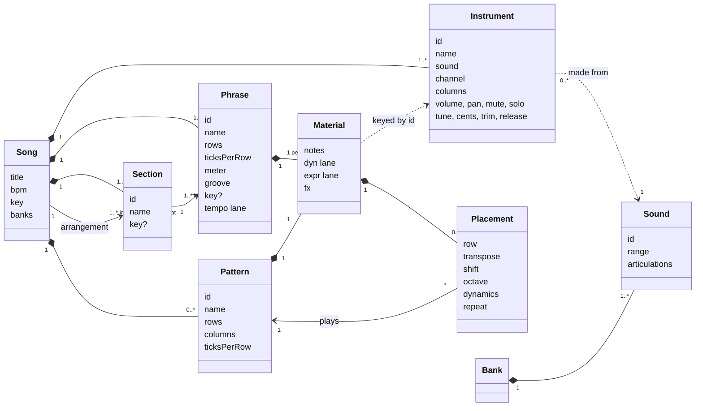

# Tutti domain model

The vocabulary the app, the specs, the file format and the guide all use. One word per concept, one home per concept, and the JSON field is the same word as the label on screen. Format version 4 is the first to follow this document; earlier files are not read.

The aim is a song you can read top to bottom in the words musicians already use: a song is arranged from sections, a section is made of phrases, a phrase is a few bars for every instrument, and the ideas inside it are patterns placed on instruments.

## Vocabulary

| Term | Meaning | What musicians call it | Lives in |
|---|---|---|---|
| **Song** | The whole piece: instruments, patterns, phrases, sections, arrangement, tempo, key, banks. The aggregate root. | work, tune, song | file |
| **Instrument** | A player in this song, made from a sound: its name, MIDI channel, 1 to 4 note columns, its place in the mix (volume, pan, mute, solo) and how the sound is shaped for it (tune, cents, trim, release). Constant across the song. Any number of instruments can be made from one sound: two fiddles a few cents apart are two instruments. | instrument, player, desk, staff | song.instruments |
| **Sound** | What an instrument is made from: samples or a synth patch with a range and a list of articulations, provided by a bank. Read-only and shared; it has no settings of its own. | the instrument itself, as opposed to the player; patch, source | instrument.sound, named by id |
| **Arrangement** | The sections in playing order, each with a repeat. | form: AABA, verse and chorus, sonata | song.arrangement |
| **Section** | A named span of the song made of phrases in order, each with a repeat; may carry its own key. | intro, verse, chorus, bridge, outro; A section, B section, head; exposition, development, coda; a movement | song.sections |
| **Phrase** | A few bars for every instrument: rows, row size, meter, tempo lane, groove, and material per instrument. The unit the grid shows. | phrase; a line of the verse; four or eight bars | song.phrases |
| **Material** | What one instrument holds inside a phrase: loose notes, lanes, fx and placements. Also the shape a pattern holds, without placements. | the instrument's part for those bars | phrase.material[instrument], pattern.material |
| **Pattern** | A reusable line of notes for one voice, written once: notes, articulation, its own lanes and fx. | motif, riff, lick, figure, ostinato, hook, fill | song.patterns |
| **Placement** | One use of a pattern: on a instrument of a phrase, at a row, with its transformations. Editing the pattern changes every placement. | a statement of the motif; the riff again, a fourth up | material.placements |
| **Transformation** | How a placement changes the pattern it plays: transpose (semitones), shift (scale degrees in the key in force), octave, dynamics (a velocity offset), repeat. | transposition, sequence, octave displacement, dynamic marking | placement fields |
| **Modulation** | A section or phrase taking its own key. Never a property of a placement. A key does not move typed notes; it decides what is in scale and where a shift lands. | modulation | section.key, phrase.key |
| **Note** | A pitch at a tick in a note column with velocity, length and articulation. "Notes" is the field; "events" is what the renderer emits. | note | material.notes |
| **Lane** | A stepped or ramped controller line: dynamics (`dyn`) and expression (`expr`) per instrument, `tempo` per phrase. | hairpins, tempo marks | material, phrase |
| **Bank** | A set of sounds a song can name and load. | ensemble, library | song.banks |
| **Render** | Turning the arrangement into timed events for playback, MIDI out and file export. | performance | core |

Verbs: **place** a pattern, **detach** a placement, **transform** a placement, **arrange** sections, a section or phrase **repeats**, a section **modulates**, a song **renders**.

Words not used: *follows*, *chain*, *entry*, *motif* on any label (the guide may gloss it), *clip*, *block*, *scene*, *part*, *order*, *event* for stored notes. If one appears in a spec, a label or a field name, it is a mistake to correct.

## In the app: levels and the map

A song has four levels, and the **map** bar under the header shows them with the current one lit: **Song › Section › Phrase › Pattern**. Every crumb is a button.

| Level | What you see | In | Out |
|---|---|---|---|
| Song | the **Song view**: sections in playing order, their phrases, and for every phrase what each instrument plays (a thumbnail and a chip per placed pattern); the arrangement is edited here and the patterns are listed underneath | Enter, a double click or a second tap opens that phrase on that instrument; a pattern chip opens that pattern | — |
| Section | the same view, on that section | | |
| Phrase | the grid: every instrument, the phrase's rows | Enter on a pattern tag opens the pattern | the backquote key, or a crumb |
| Pattern | the same grid with one instrument and the pattern's rows | | the backquote key, Esc, or a crumb |

The **monitor** shows the note each instrument is sounding while the song plays: beside the instrument name in the grid header, in the Song view's instrument headers, and on the mixer strips. The map also says where the playhead is, in the song's own words: `▶ Bridge › B1`.

## For M8 users

| M8 | Tutti |
|---|---|
| song row | a phrase, in the order its section lists it |
| section (consecutive rows) | **section** |
| cell: the chain a track plays on a row | the instrument's column of placements inside that phrase |
| chain | the placements of one instrument in one phrase, read top to bottom |
| chain step: phrase + transpose | **placement**: pattern + transformations |
| phrase | **pattern** |
| instrument per step | the instrument's sound |
| the song screen | the **Song view** |
| the SCPIT map | the **map**: Song › Section › Phrase › Pattern |
| the track readout | the **monitor** |

A placement is one **step** of a chain, not the chain. The chain itself has no word in Tutti because it is not an object: it is what you see when you read one instrument down one phrase. Three differences follow. It is not reusable on its own; you reuse patterns, phrases and sections instead. Its steps sit at rows, so they may leave gaps and share the instrument with loose notes. And every instrument in a phrase has the same length, so instruments cannot drift against each other.

## Structure



Rules that keep it consistent:

1. **Reuse happens at three levels and nowhere else.** A pattern is placed many times. A phrase may appear in more than one section. A section may appear more than once in the arrangement.
2. **A placement never copies.** Detach is the only way to get loose notes out of a pattern, and it bakes the transformations in.
3. **A pattern belongs to a kind of voice, not a instrument.** Any instrument can place it; columns beyond the instrument's are dropped at render time. A pattern never places another pattern.
4. **Only a phrase owns time.** Rows, meter, tempo lane and groove. Patterns inherit them where they are placed.
5. **Keys nest.** Phrase over section over song. A placement's shift uses the key in force where it sounds, so a phrase reused in a section with another key sounds its shifted patterns in that key.
6. **Everything a instrument plays in a phrase is visible in that phrase.** There is no reference from one phrase to another.
7. **The song is always showable.** A section keeps at least one phrase and the arrangement at least one section. A section taken out of the arrangement stays in the song, not arranged, until it is deleted; a phrase that loses its last section goes with it.

## File format, version 4

One JSON document per song. Patterns, phrases and sections have an `id` because something names them; instruments have an `id` because material is keyed by instrument; everything else is addressed by position.

```json
{
  "$schema": "https://ajturner.github.io/tutti-music/schema/tutti-song.schema.json",
  "format": "tutti-song", "version": 4, "uid": "c1f0…",
  "title": "Blue room", "notes": "", "bpm": 132, "key": { "root": 5, "scale": "major" },
  "banks": ["jazz"],
  "instruments": [
    { "id": "sax", "name": "Tenor sax", "sound": "tenor-sax", "channel": 1, "columns": 1, "pan": 52, "cents": -4 },
    { "id": "bass", "name": "Upright bass", "sound": "upright-bass", "channel": 2, "columns": 1 },
    { "id": "kit", "name": "Drum kit", "sound": "drum-kit", "channel": 10, "columns": 2, "trim": -2 }
  ],
  "patterns": [
    { "id": "riff", "name": "Riff", "rows": 16, "ticksPerRow": 240, "columns": 1,
      "material": { "notes": [{ "col": 0, "tick": 0, "pitch": 65, "vel": 96, "len": 480, "art": "sus" }], "dyn": [], "expr": [], "fx": [] } },
    { "id": "walk", "name": "Walk", "rows": 16, "ticksPerRow": 240, "columns": 1,
      "material": { "notes": [{ "col": 0, "tick": 0, "pitch": 41, "vel": 90, "len": 960, "art": "sus" }], "dyn": [], "expr": [], "fx": [] } },
    { "id": "ride", "name": "Ride", "rows": 16, "ticksPerRow": 240, "columns": 2,
      "material": { "notes": [{ "col": 0, "tick": 0, "pitch": 51, "vel": 80, "len": 240, "art": null }], "dyn": [], "expr": [], "fx": [] } }
  ],
  "phrases": [
    { "id": "a1", "name": "A", "rows": 64, "ticksPerRow": 240, "meter": [4, 4], "groove": [1.33, 0.67], "key": null, "tempo": [],
      "material": {
        "sax":  { "notes": [], "dyn": [], "expr": [], "fx": [], "placements": [{ "pattern": "riff", "row": 0, "repeat": 2 }, { "pattern": "riff", "row": 32, "shift": 3, "repeat": 2 }] },
        "bass": { "notes": [], "dyn": [], "expr": [], "fx": [], "placements": [{ "pattern": "walk", "row": 0, "repeat": 2 }, { "pattern": "walk", "row": 32, "transpose": 5, "repeat": 2 }] },
        "kit":  { "notes": [], "dyn": [], "expr": [], "fx": [], "placements": [{ "pattern": "ride", "row": 0, "repeat": 4 }] }
      } },
    { "id": "b1", "name": "Bridge", "rows": 64, "ticksPerRow": 240, "meter": [4, 4], "groove": [1.33, 0.67], "key": null, "tempo": [],
      "material": {
        "sax":  { "notes": [{ "col": 0, "tick": 0, "pitch": 70, "vel": 100, "len": 1920, "art": "sus" }], "dyn": [], "expr": [], "fx": [], "placements": [] },
        "bass": { "notes": [], "dyn": [], "expr": [], "fx": [], "placements": [{ "pattern": "walk", "row": 0, "transpose": 5, "repeat": 4 }] },
        "kit":  { "notes": [], "dyn": [], "expr": [], "fx": [], "placements": [{ "pattern": "ride", "row": 0, "dynamics": -16, "repeat": 4 }] }
      } }
  ],
  "sections": [
    { "id": "a", "name": "A", "key": null, "phrases": [{ "phrase": "a1", "repeat": 2 }] },
    { "id": "bridge", "name": "Bridge", "key": { "root": 10, "scale": "major" }, "phrases": [{ "phrase": "b1", "repeat": 2 }] }
  ],
  "arrangement": [
    { "section": "a", "repeat": 2 }, { "section": "bridge", "repeat": 1 }, { "section": "a", "repeat": 1 }
  ]
}
```

Reading it back: the tune is A A B A. Each A is the eight-bar phrase twice. In it the sax states the riff twice, then twice more three scale steps up; the bass walks under it and moves up a fourth for the second half; the ride pattern runs four times. The bridge section is in B♭, the sax plays loose long notes, and the ride is placed softer. Everything a instrument plays is in the phrase you are looking at.

Rules the loader enforces, in this order:

1. A song needs `phrases` and a list of `instruments`, which may be empty: a new song has none until the composer chooses its players. An instrument's `volume`, `pan`, `tune`, `cents`, `trim` and `release` take their defaults (100, 64, 0, 0, 0, 1) and are clamped. A draft of format 4 that still says `instruments`, each with an `instrument`, is read as instruments with a `sound`. A `version` below 4, or none, is refused with a message naming it; a newer one too.
2. Every phrase gets a unique `id` (from its name when missing or duplicated); materials are filled with empty lists; a pattern's `placements` are emptied.
3. A placement naming a missing pattern is removed; `transpose`, `shift`, `octave`, `dynamics` and `repeat` take their defaults (0, 0, 0, 0, 1) and are clamped.
4. A section's slots naming a missing phrase are dropped, and a section left empty is dropped. With no section left, one section **A** holds every phrase in order.
5. Phrases in no section are gathered into a section **Spare** that is not arranged, so nothing is lost and nothing plays that was not asked for.
6. Arrangement items naming a missing section are dropped. An empty arrangement plays every section once.

Within format 4, before its release: tracks became **instruments** made from **sounds**, and tuning, trim and release moved from the browser into the instrument, so they travel with the song and two instruments can share a sound. What changed from version 3, all deliberate: the words pattern and phrase swapped (a phrase is the block for every instrument, a pattern the reusable line); `sections` and an arrangement of sections replaced the arrangement of entries; `follows` is gone, because a looping part is a placement with a repeat in plain sight; placements gained `shift`, `octave` and `dynamics`; a section may carry a `key`. The exported .mid carries a marker at every section.

## Workflows

Each is written as the guide describes it. The last line says what the song contains afterwards.

### 1. A string quartet sketch (one phrase, then two)

1. **Files → New.** A new song has no instruments, so it opens on Instruments with the sounds showing: press **+** on Violins I, Violins II, Violas and Cellos. Rename the song in the header. Key C major, from the ▾ beside the song's name.
2. Type the cello line with step 16, the inner voices, then the melody on Violins I. A dynamics ramp from 30 to 60 across the four bars.
3. Map → **Song**. On section A choose **+ phrase… → copy of the phrase under the cursor**, open it and change the last two chords. Section A is now an eight-bar period: A1 then A2.
4. **Files → Export .mid**, or **Save JSON**.

Afterwards: 4 instruments, 1 section, 2 phrases, no patterns. The words section and pattern were never needed.

### 2. A folk reel (patterns inside phrases, AABB)

1. A song from the folk bank: Fiddle, Banjo, Frame drum. Type the fiddle's A tune in phrase A1.
2. Song view: **+ section… → new section** makes B with phrase B1; type the B tune. Set both arrangement items to **×2**: the form reads `A×2 B×2`.
3. Banjo in A1: type an 8-row vamp, select it, **Make pattern**, name it *Vamp* in Compose. On the tag press <kbd>]</kbd> three times: `▸Vamp ×4`. ⌘D, then <kbd>=</kbd> five times on the copy: `▸Vamp +5 ×4`.
4. In B1 paste the same two placements. Fix a wrong note once: Enter on a tag, edit, backquote. All four follow.
5. The second time through B should end differently: in the Song view **+ phrase… → copy** on B, set B1 to ×1, and detach the fiddle's last bar in the copy.

Afterwards: 2 sections, 3 phrases, 1 pattern with 4 placements, arrangement `A×2 B`, where B is B1 then B1 copy.

### 3. An electronica track (a riff that stays in the key)

1. Electronica bank: Pad, Lead, Bass, Drum machine. Key A natural minor.
2. Phrase Verse 1: pads and lead as loose notes, drums typed. Bass: type one bar of riff, **Make pattern** → *Riff*. Place it on every bar and press <kbd>,</kbd> or <kbd>.</kbd> on each tag: `▸Riff`, `▸Riff ↓2`, `▸Riff ↑2`, `▸Riff ↓1` follow A, F, C, G and stay in the key.
3. Song view: a section **Drop** with a copy of the phrase, the lead added, ×2. Then **+ section… → play a section again → Verse**: `Verse Drop Verse`.
4. Change the bass everywhere: open *Riff* from its card in the Song view. Make the drop hit harder: on the Drop's drum placement press <kbd>&gt;</kbd>.

Afterwards: 2 sections, 2 phrases, 1 pattern with 8 placements, arrangement of 3 items.

### 4. A film cue (a changing meter and a modulation)

1. Orchestra. Phrase A1 in 4/4: an ostinato on Violas, **Make pattern** → *Ostinato*. Place it on Cellos, and on Violins II with <kbd>⇧=</kbd>: `8va+1`.
2. Section **B**: its phrase in 7/8, 56 rows. In the Song view give B the key D minor: the modulation lives on the section.
3. In B place *Ostinato* with a shift: it lands on D minor's degrees without retyping.
4. Arrangement `A×2 B A`. Export .mid: markers A, A, B, A, and the meter change on the conductor track.

Afterwards: 2 sections with different keys and meters, 1 pattern placed in both.

### 5. A jazz head (AABA, a bridge in another key)

The file above. Sections A and Bridge; the arrangement `A×2 Bridge A`; the riff stated and then sequenced up three degrees; the ride softer in the bridge; **Loop section** loops the bridge while you write it.

Afterwards: 2 sections, 2 phrases, 3 patterns, 7 placements.

### 6. A live set

1. **Play phrase** loops the open phrase. Choose another in the selector: it is queued and takes over when the loop ends.
2. **Loop section** loops a whole section; the map follows the playing phrase. In the Song view, **Play from here** goes forward instead: the phrase's repeats, the section's, then the next section.
3. The mixer's M and S by touch; the monitor shows who is sounding.

Afterwards: nothing new in the song.

### 7. Two fiddles from one sound

1. Instruments: on **Fiddle** press **⧉**. A second player appears, **Fiddle 2**, made from the same sound with the same settings, on a free channel, with no notes. Rename it Fiddle II.
2. Open it with **⋯**: cents +7, pan right. On the first fiddle: cents −6, pan left. The rows now read `−6c` and `+7c`.
3. In the grid, place the first fiddle's pattern on Fiddle II and press ⇧− for an octave down, < twice for softer.

Afterwards: 2 instruments, 1 sound, 1 pattern, 2 placements. The samples loaded once; the tuning travels in the song file; exported MIDI has two channels at the written pitch.

## Deliberately left out

- **A chain object.** Reuse of one instrument's run of placements across phrases is a copy and paste. If it proves painful, the fix is a pattern that may place patterns, not a new noun.
- **Transposing a section in the arrangement** (the last chorus up a tone). A key does not move notes; this would be a transformation on an arrangement item and can be added without a format break.
- **Tempo on a section.** The phrase's tempo lane is the one owner of time.

## Planned terms

Words the roadmap (docs/roadmap.md) will add, fixed now so specs and labels agree when they arrive. Every field is optional; none needs a format break.

| Term | Meaning | Lives in |
|---|---|---|
| **Chord** | A symbol (root, quality, extensions) at a row of a phrase's chord lane, held until the next. Describes; never sounds. | phrase.chords |
| **Role** | What a note is against the chord on its row: root, third, fifth, seventh, extension, in scale, outside. | derived |
| **Check** | A rule evaluated over expanded material, reported as findings; informs, never blocks. | core |
| **Finding** | One result of a check: row, instruments, reason. | derived |
| **Exercise** | A prompt with the checks that apply and the rows it covers, attached to a song or a phrase. | song.exercise, phrase.prompt |
| **Scratch** | The phrase Capture records into. | song.scratch |
| **Variation** | A pattern derived from another by an operation (invert, retrograde, displace, thin, augment, diminish, shuffle). | pattern.from |
| **Loop selection**, **Slow**, **Interval** | Listening controls: play the selected rows, scale the tempo, name the distance to the bass. | UI only |

## Consistency checklist for specs and UI

- A JSON field is spelled exactly like the term: `arrangement`, `sections`, `phrases`, `patterns`, `material`, `placements`, `notes`. New fields join the vocabulary table first.
- Transpose, shift, octave, dynamics and repeat are properties of a placement, never of a pattern. Repeat is also a property of a section's phrase slot and of an arrangement item, never of a phrase or section itself.
- Only a phrase has a tempo lane, groove and meter.
- A tag, the status line, the map and the Song view name a placement the same way: `Riff ↑3 +5 8va+1 v−16 ×2`.
- The map's levels are always Song, Section, Phrase, Pattern, in that order.
- Patterns are the song's; there is no store across songs.
