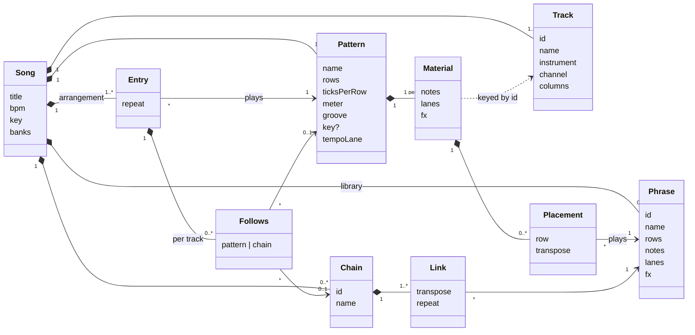
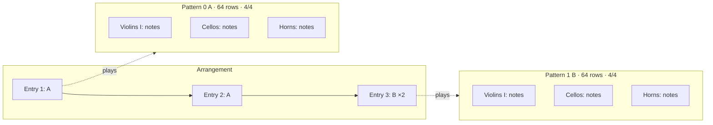
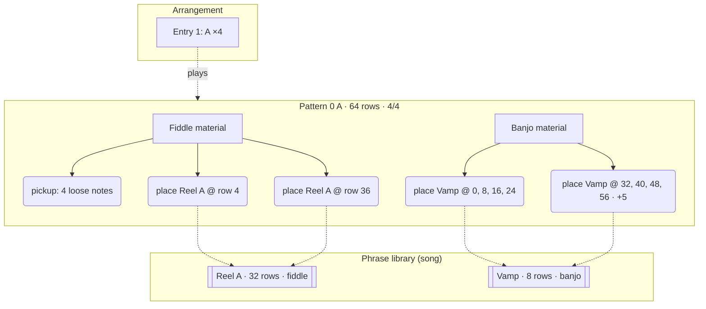
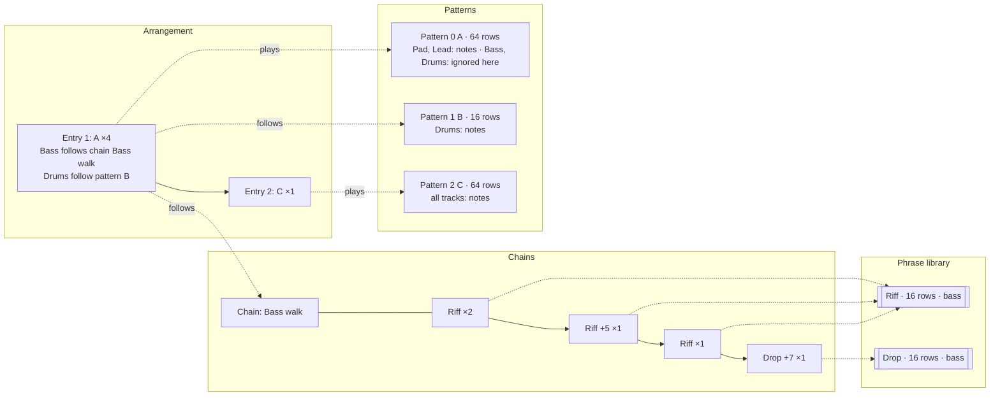
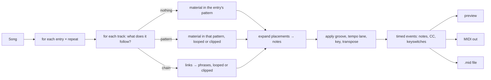
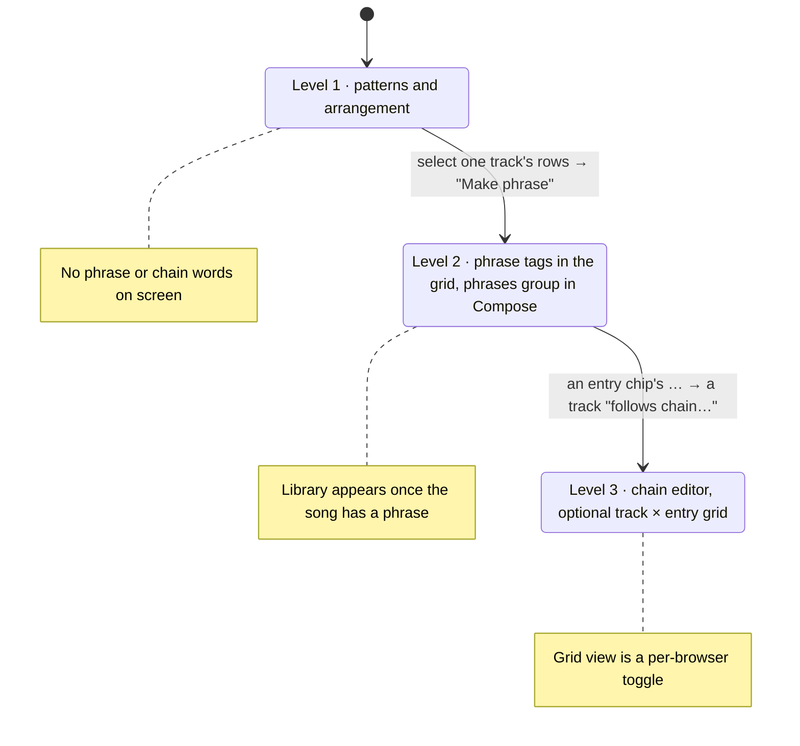

# Tutti domain model

The vocabulary the app, the specs, the file format and the guide all use. One word per concept; a concept has one home in the song. Where the JSON field and the UI word differ, both are given and the UI word is the one people read.

## Ubiquitous language

| Term | Meaning | Lives in | Identity |
|---|---|---|---|
| **Song** | The whole piece: tracks, patterns, phrases, chains, arrangement, tempo, key, banks. The aggregate root; every edit goes through it. | file | title + storage id |
| **Track** | One instrument voice with a MIDI channel and 1 to 4 note columns. Tracks are the columns of every pattern. | song | `id` |
| **Pattern** | A block of rows across *all* tracks, with its own length, row size, meter, tempo lane, groove and optional key. The unit a beginner composes in. | song | index + name (`0 A`) |
| **Material** | What a track holds inside one pattern: loose notes, lanes (dynamics, expression), fx and placements. | pattern.tracks[track] | none (owned) |
| **Phrase** | A reusable block of one track's material, a fixed number of rows long, kept once in the song's library. | song.phrases | `id` + name |
| **Placement** | "Play phrase P here": a reference from a track's material to a phrase at a row, with a transpose. Editing the phrase changes every placement. | material.placements | none (value) |
| **Chain** | A named sequence of links for one track: each link is a phrase, a transpose and a repeat count. | song.chains | `id` + name |
| **Arrangement** (file: `order`) | The list of entries that make the song from start to end. | song.order | none |
| **Entry** | One step of the arrangement: a pattern, a repeat count, and per-track *follows*. | arrangement | position |
| **Follows** | An entry's override for one track: instead of the entry's pattern the track follows another pattern or a chain, looped or clipped to the entry's length. | entry.tracks[track] | none (value) |
| **Bank** | A set of sampled or synthesised instruments a song can name and load. | song.banks | `id` |
| **Render** | Turning the arrangement into timed events (notes, controllers, keyswitches) for playback, MIDI out and file export. | core | none (pure) |

Verbs, used the same way everywhere: **place** a phrase, **detach** a placement into loose notes, **transpose** a placement or link, a track **follows** a pattern or chain, an entry **repeats**, a song **renders**.

Words not used: *clip*, *block*, *sequence*, *scene*, *part*. If one of these appears in a spec or a label, it is a mistake to correct.

## Structure

Three rules keep the model consistent:

1. **A phrase belongs to a track kind, not a track.** It carries notes for one voice; any track can place it. Articulations that the placing track's instrument lacks fall back at render time, exactly as when a track changes instrument.
2. **A placement never copies.** Detaching is the only way to get loose notes out of a phrase, and it is explicit.
3. **Follows is the only cross-pattern reference in the arrangement.** A chain is reached through an entry's follows, never directly from a pattern.

## Three songs

### Level 1: Sketch in C, patterns only

Two patterns, every track written in each. The arrangement plays them. No phrase, no chain, and none of those words appear in the UI.

### Level 2: Crossroads reel, phrases inside patterns

A reel repeats its A part with a new ending and vamps under it. The fiddle's tune is one phrase placed twice; the banjo vamp is an 8-row phrase placed eight times, the last four transposed up a fourth. Loose notes still exist: the fiddle's pickup bar is typed directly.

What the user sees: a tag at rows 4 and 36 of the Fiddle track reading `Reel A`, tags on the Banjo track reading `Vamp` and `Vamp +5`, and a **phrases** group in Compose listing `Reel A (2 uses)` and `Vamp (8 uses)`. Pressing Enter on a tag opens the phrase; changing one note of the vamp changes all eight bars.

### Level 3: Night drive, chains under a pattern

An electronica track where the pads and lead sit in one long pattern while the bass and drums have their own life. Entry 1 plays pattern A four times; the bass follows a chain and the drums follow pattern B, both looped to the entry's length. Only the tracks that need independence leave the pattern.

The timeline the renderer produces for entry 1 (256 rows). Rows are the entry's; each track fills them independently:

| rows | Pad, Lead (pattern A) | Bass (chain Bass walk) | Drums (pattern B) |
|---|---|---|---|
| 0–15 | A, rows 0–15 | Riff | B |
| 16–31 | A, rows 16–31 | Riff | B |
| 32–47 | A, rows 32–47 | Riff +5 | B |
| 48–63 | A, rows 48–63 | Riff | B |
| 64–79 | A again, rows 0–15 | Drop +7 | B |
| 80–95 | A, rows 16–31 | Riff (chain loops) | B |
| … | … | … | … |
| 240–255 | A, rows 48–63 | Drop +7 | B |

A chain shorter than the entry loops; longer is clipped. That is the rule chained patterns already follow today, so a chain is a pattern-sized thing from the renderer's point of view.

## Rendering

Every playback path goes through the same expansion, so MIDI export, the sampler and the synth cannot disagree.

## How the levels unfold in the UI

## Consistency checklist for specs and UI

- The library is the song's; there is no global phrase store across songs (export a song to share phrases).
- A pattern is the only thing that has a tempo lane, groove and meter. Phrases and chains inherit them from the entry's pattern.
- Transpose is a property of a placement or link, never of a phrase.
- Repeat is a property of an entry or link, never of a phrase or pattern.
- "Follows" always names the target kind: *follows pattern B*, *follows chain Bass walk*.
- The status line names things exactly as the library does: `phrase Reel A +5, used 2×`.
