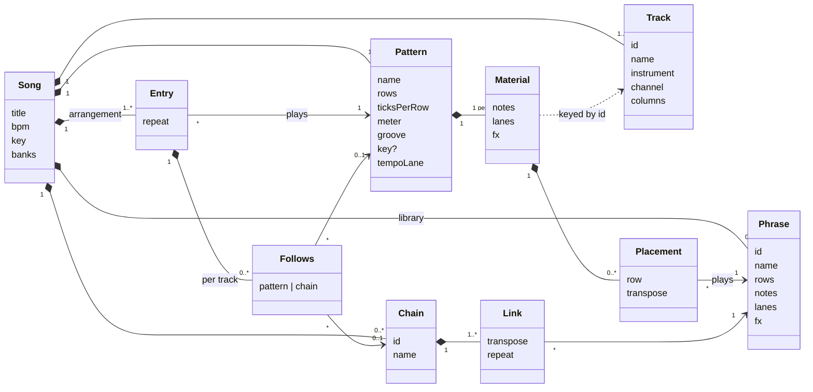
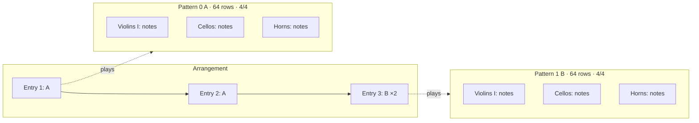
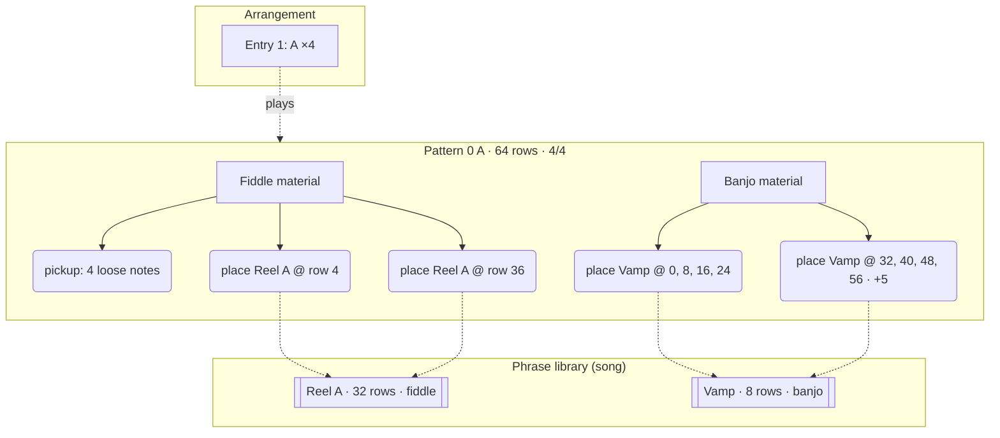
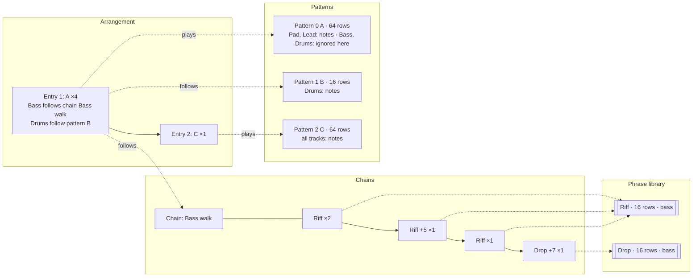
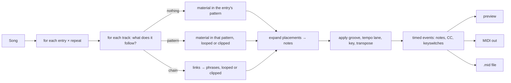
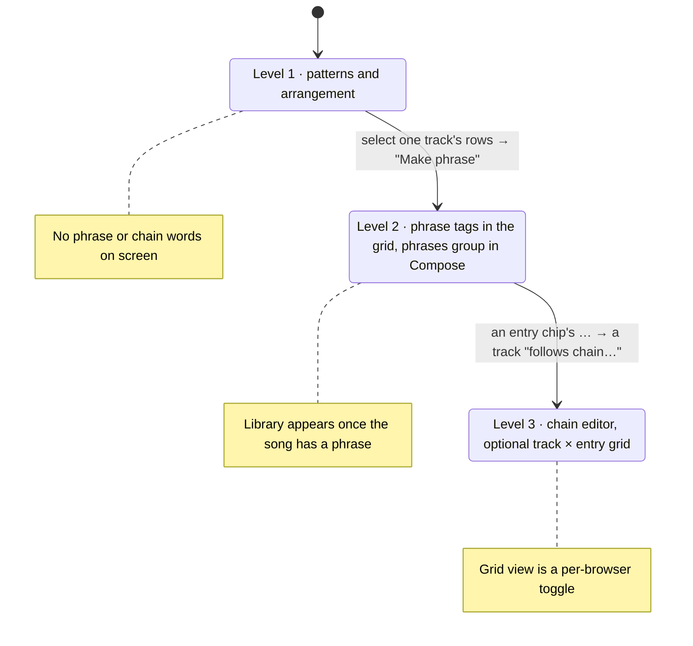

# Tutti domain model

The vocabulary the app, the specs, the file format and the guide all use. One word per concept, one home per concept, and the JSON field is the same word as the label on screen. Format version 3 is the first to follow this document; earlier files are not read (no songs were saved with them).

## Ubiquitous language

| Term | Meaning | Lives in | Identity |
|---|---|---|---|
| **Song** | The whole piece: tracks, patterns, phrases, chains, arrangement, tempo, key, banks. The aggregate root; every edit goes through it. | file | title + storage id |
| **Track** | One instrument voice with a MIDI channel and 1 to 4 note columns. Tracks are the columns of every pattern. | song | `id` |
| **Pattern** | A block of rows across *all* tracks, with its own length, row size, meter, tempo lane, groove and optional key. The unit a beginner composes in. | song | index + name (`0 A`) |
| **Material** | What a track holds inside one pattern: loose notes, lanes (dynamics, expression), fx and placements. | pattern.material[track] | none (owned) |
| **Phrase** | A reusable block of one track's material, a fixed number of rows long, kept once in the song's library. | song.phrases | `id` + name |
| **Placement** | "Play phrase P here": a reference from a track's material to a phrase at a row, with a transpose. Editing the phrase changes every placement. | material.placements | none (value) |
| **Chain** | A named sequence of links for one track: each link is a phrase, a transpose and a repeat count. | song.chains | `id` + name |
| **Arrangement** | The list of entries that make the song from start to end. | song.arrangement | none |
| **Entry** | One step of the arrangement: a pattern, a repeat count, and per-track *follows*. | arrangement | position |
| **Follows** | An entry's override for one track: instead of the entry's pattern the track follows another pattern or a chain, looped or clipped to the entry's length. | entry.follows[track] | none (value) |
| **Bank** | A set of sampled or synthesised instruments a song can name and load. | song.banks | `id` |
| **Note** | A pitch at a row in a note column with velocity, length and articulation. "Notes" is the field; "events" is reserved for what the renderer emits. | material, phrase | none (value) |
| **Lane** | A stepped or ramped controller line: dynamics (`dyn`), expression (`expr`) per track, tempo per pattern. | material, phrase, pattern | none (value) |
| **Render** | Turning the arrangement into timed events (notes, controllers, keyswitches) for playback, MIDI out and file export. | core | none (pure) |

Verbs, used the same way everywhere: **place** a phrase, **detach** a placement into loose notes, **transpose** a placement or link, a track **follows** a pattern or chain, an entry **repeats**, a song **renders**.

Words not used: *clip*, *block*, *sequence*, *scene*, *part*, *order*, *event* (for stored notes). If one of these appears in a spec, a label or a field name, it is a mistake to correct.

## File format, version 3

One JSON document per song. Field names are the vocabulary above; nothing is abbreviated except the two lane names. Every list item that can be referenced has an `id`; everything else is addressed by position.

```json
{
  "$schema": "https://ajturner.github.io/tutti-music/schema/tutti-song.schema.json",
  "format": "tutti-song", "version": 3, "uid": "…",
  "title": "Crossroads reel", "notes": "", "bpm": 112, "key": { "root": 7, "scale": "major" },
  "banks": ["folk"],
  "tracks": [
    { "id": "fid", "name": "Fiddle", "instrument": "fiddle", "channel": 1, "columns": 1, "mute": false, "volume": 100, "pan": 64 },
    { "id": "bjo", "name": "Banjo", "instrument": "banjo", "channel": 2, "columns": 2, "mute": false }
  ],
  "patterns": [
    { "name": "A", "rows": 64, "ticksPerRow": 240, "meter": [4, 4], "groove": [], "key": null, "tempo": [],
      "material": {
        "fid": { "notes": [{ "col": 0, "tick": 0, "pitch": 74, "vel": 96, "len": 240, "art": "sus" }],
                 "dyn": [], "expr": [], "fx": [],
                 "placements": [{ "phrase": "reelA", "row": 4, "transpose": 0 }, { "phrase": "reelA", "row": 36, "transpose": 0 }] },
        "bjo": { "notes": [], "dyn": [], "expr": [], "fx": [],
                 "placements": [{ "phrase": "vamp", "row": 0 }, { "phrase": "vamp", "row": 8 }, { "phrase": "vamp", "row": 32, "transpose": 5 }] }
      } }
  ],
  "phrases": [
    { "id": "reelA", "name": "Reel A", "rows": 32, "ticksPerRow": 240, "columns": 1, "notes": [], "dyn": [], "expr": [], "fx": [] },
    { "id": "vamp",  "name": "Vamp",   "rows": 8,  "ticksPerRow": 240, "columns": 2, "notes": [], "dyn": [], "expr": [], "fx": [] }
  ],
  "chains": [
    { "id": "walk", "name": "Bass walk", "links": [{ "phrase": "riff", "transpose": 0, "repeat": 2 }, { "phrase": "riff", "transpose": 5, "repeat": 1 }] }
  ],
  "arrangement": [
    { "pattern": 0, "repeat": 4, "follows": { "bjo": { "chain": "walk" } } },
    { "pattern": 1, "repeat": 1, "follows": {} }
  ]
}
```

Rules the loader enforces, in this order: a song needs `tracks`, `patterns` and `arrangement`; an entry naming a missing pattern is dropped; a follows naming the entry's own pattern, a missing pattern or a missing chain is removed; a placement or link naming a missing phrase is removed; a phrase's `columns` may be fewer than the placing track's but never more (extra columns are dropped at render time with a status warning); `ticksPerRow` on a phrase lets it be placed in a pattern with a different row size, scaled as chained patterns are today.

What changes from version 2, all deliberate: `order` → `arrangement`, entry `tracks` → `follows`, pattern `tracks` → `material`, `events` → `notes`, plus the new `phrases`, `chains` and `placements`. Version 1 and 2 files are refused with a message; the built-in examples are code and move with the app.

## Structure



Three rules keep the model consistent:

1. **A phrase belongs to a track kind, not a track.** It carries notes for one voice; any track can place it. Articulations that the placing track's instrument lacks fall back at render time, exactly as when a track changes instrument.
2. **A placement never copies.** Detaching is the only way to get loose notes out of a phrase, and it is explicit.
3. **Follows is the only cross-pattern reference in the arrangement.** A chain is reached through an entry's follows, never directly from a pattern.

## Three songs

### Level 1: Sketch in C, patterns only

Two patterns, every track written in each. The arrangement plays them. No phrase, no chain, and none of those words appear in the UI.



### Level 2: Crossroads reel, phrases inside patterns

A reel repeats its A part with a new ending and vamps under it. The fiddle's tune is one phrase placed twice; the banjo vamp is an 8-row phrase placed eight times, the last four transposed up a fourth. Loose notes still exist: the fiddle's pickup bar is typed directly.



What the user sees: a tag at rows 4 and 36 of the Fiddle track reading `Reel A`, tags on the Banjo track reading `Vamp` and `Vamp +5`, and a **phrases** group in Compose listing `Reel A (2 uses)` and `Vamp (8 uses)`. Pressing Enter on a tag opens the phrase; changing one note of the vamp changes all eight bars.

### Level 3: Night drive, chains under a pattern

An electronica track where the pads and lead sit in one long pattern while the bass and drums have their own life. Entry 1 plays pattern A four times; the bass follows a chain and the drums follow pattern B, both looped to the entry's length. Only the tracks that need independence leave the pattern.



The timeline the renderer produces for entry 1 (256 rows). Rows are the entry's; each track fills them independently:

| rows | Pad, Lead (pattern A) | Bass (chain Bass walk) | Drums (pattern B) |
|---|---|---|---|
| 0–15 | A, rows 0–15 | Riff | B |
| 16–31 | A, rows 16–31 | Riff | B |
| 32–47 | A, rows 32–47 | Riff +5 | B |
| 48–63 | A, rows 48–63 | Riff | B |
| 64–79 | A again, rows 0–15 | Drop +7 | B |
| 80–95 | A, rows 16–31 | Riff (chain loops) | B |
| … | … | … | … |
| 240–255 | A, rows 48–63 | Drop +7 | B |

A chain shorter than the entry loops; longer is clipped. That is the rule chained patterns already follow today, so a chain is a pattern-sized thing from the renderer's point of view.

## Rendering

Every playback path goes through the same expansion, so MIDI export, the sampler and the synth cannot disagree.



## How the levels unfold in the UI



## Consistency checklist for specs and UI

- The library is the song's; there is no global phrase store across songs (export a song to share phrases).
- A pattern is the only thing that has a tempo lane, groove and meter. Phrases and chains inherit them from the entry's pattern.
- Transpose is a property of a placement or link, never of a phrase.
- Repeat is a property of an entry or link, never of a phrase or pattern.
- "Follows" always names the target kind: *follows pattern B*, *follows chain Bass walk*.
- A JSON field is spelled exactly like the term: `arrangement`, `follows`, `material`, `placements`, `phrases`, `chains`, `notes`. New fields join the table above first.
- The status line names things exactly as the library does: `phrase Reel A +5, used 2×`.

## Workflows

Each workflow is written in the vocabulary above, as the guide will describe it. Steps name the panel or key; the last line says what the song contains afterwards.

### 1. A string quartet sketch (patterns only)

Goal: an eight-bar idea with two sections, written straight into the grid.

1. **Song → New.** Rename it in the header title. Compose → tracks: remove everything but Violins I, Violins II, Violas, Cellos.
2. **Compose → pattern.** Rows 64, row 1/16, meter 4/4. Key C major so scale-degree keys and in-key colouring work.
3. Type the cello line on the grid with step 16 (`⇧=` raises the step), then the inner voices, then the melody on Violins I. Dynamics lane: a ramp from 30 to 60 across the four bars.
4. **Compose → pattern → +** adds pattern 1 B copied in size. Change the last two chords.
5. **Compose → arrangement:** `0 0 1 1`, or drag the chips. Play song.
6. **Song → Export .mid** to continue in a DAW, or **Save JSON**.

Afterwards: 4 tracks, 2 patterns, arrangement of 4 entries, no phrases, no chains. The words phrase and chain never appeared.

### 2. A folk reel (phrases inside a pattern)

Goal: the A part of a reel repeated with a different ending, a banjo vamp underneath, and the ending varied without retyping.

1. Song from the folk bank (Sounds → banks → Folk group, or open the Crossroads reel showcase). Tracks: Fiddle, Banjo (2 columns), Frame drum.
2. Type the fiddle's first 32 rows of tune after a 4-row pickup. Select rows 4 to 35 on Fiddle, **Make phrase** on the selection toolbar, name it *Reel A*. The notes become a placement tagged `Reel A` at row 4.
3. Cursor at row 36, `⌘V`: a second placement of *Reel A*. The status line reads `phrase Reel A, used 2×, Enter edits`.
4. Banjo: type an 8-row vamp, select it, **Make phrase** → *Vamp*. Paste it at rows 8, 16, 24. Select the four placements, `⌘D` to duplicate after them, then `=` five times: the second half reads `Vamp +5`.
5. The ending should differ: cursor on the second *Reel A* placement, **Detach** (selection toolbar). Its last four rows are now loose notes; change them.
6. Fix a wrong note in the tune: Enter on the first tag opens *Reel A* in the grid, edit, Esc. The first placement follows; the detached copy does not, which is what was wanted.
7. Compose → phrases lists *Reel A (1 use)* and *Vamp (8 uses)* with audition and rename. Arrangement `0x4`.

Afterwards: 1 pattern, 2 phrases, 9 placements, loose notes for the pickup and the ending, no chains.

### 3. An electronica track (chains under a long pattern)

Goal: pads and lead in one 64-row pattern, a bass line that walks through transpositions, drums from a short loop, and a breakdown.

1. Song from the Electronica bank. Tracks: Pad, Lead, Bass, Drum machine.
2. Pattern 0 A, 64 rows: pads and lead. Leave Bass and Drums empty here.
3. Bass: type 16 rows of riff, **Make phrase** → *Riff*. Type a 16-row drop figure, **Make phrase** → *Drop*. Delete both placements from A; the phrases stay in the library.
4. Pattern 1 B, 16 rows: drums only.
5. **Compose → arrangement:** chip `0 A` → `…` opens the entry. Repeat 4. Bass: *follows chain…* → new chain *Bass walk*: links `Riff ×2`, `Riff +5 ×1`, `Riff ×1`, `Drop +7 ×1`. Drums: *follows pattern 1 B*.
6. Play song. The chip shows `0 A ×4 ⛓`; the grid header marks Bass with the link it is on and Drums with `B`.
7. Breakdown: pattern 2 C, 64 rows, every track typed. Arrangement `0x4 2`.
8. Change the bass everywhere at once: edit *Riff* from Compose → phrases. Change only bar three: edit the chain's third link to a new phrase *Riff b*.

Afterwards: 3 patterns, 2 phrases, 1 chain of 4 links, arrangement of 2 entries, the first with two follows.

### 4. A film cue (tutti, divisi and a changing meter)

Goal: an orchestral cue that moves from 4/4 to 7/8, with an ostinato shared by three sections.

1. Orchestra song, full roster. Compose → tracks: Violins I and Violas to 2 columns for divisi.
2. Pattern 0 A, 4/4, 64 rows: the ostinato on Violas. Select it, **Make phrase** → *Ostinato* (2 columns).
3. Place *Ostinato* on Cellos at row 0 and on Violins II at row 32 with `+12`. A phrase belongs to a track kind, so any string track can place it; Violins II's second column is ignored because the phrase has two and the track one, and the status line says so.
4. Pattern 1 B, meter 7/8, row 1/16, 56 rows, pattern key D minor. Brass chorale typed in; dynamics ramps on each brass track; timpani roll with the `T` fx.
5. Arrangement `0x2 1 0`. The pattern's meter drives the bar lines and the exported time signature.
6. Compose → tracks or the mixer: balance, pan the horns left. Export .mid: one MIDI track per Tutti track, meter changes on the conductor track.

Afterwards: 2 patterns with different meters and keys, 1 phrase with 3 placements, no chains.

### 5. A jazz head (AABA with repeats, walking bass by chain)

Goal: a 32-bar AABA head where A is written once, the bridge is different, and the bass walks under everything.

1. Jazz combo song: Piano (2 columns), Tenor sax, Upright bass, Drum kit.
2. Pattern 0 A, 128 rows (8 bars of 1/16): head on sax, comping on piano, ride pattern on drums. Leave the bass empty.
3. Pattern 1 B, 128 rows: the bridge, all but the bass.
4. Bass: type four 32-row walking figures over the A changes and two over the bridge, **Make phrase** each: *Walk I*, *Walk IV*, *Walk ii*, *Walk V*, *Bridge 1*, *Bridge 2*. Chains: *A bass* = the four A links; *B bass* = the two bridge links.
5. Arrangement `0x2 1 0`, then each entry's `…`: Upright bass follows chain *A bass* in the A entries and *B bass* in the bridge.
6. Solos: pattern 2 S, 128 rows, drums and piano comping only, sax empty. Arrangement `0x2 1 0 2x8 0x2 1 0`, bass following *A bass* or *B bass* as before. Sax solos live over MIDI in with **● Rec** on entry 4.

Afterwards: 3 patterns, 6 phrases, 2 chains, arrangement of 10 entries with follows on every one.

### 6. A live set (queueing and switching follows)

Goal: perform rather than arrange, from the phone.

1. Open a song with several patterns and a couple of chains. Play pattern to start the loop.
2. Tap another pattern in the header selector: it is queued and takes over when the loop ends; the status shows `next 1 B`.
3. Compose → arrangement on the phone: a chip's `…` and switch Bass from *follows chain A bass* to *follows pattern 2 C*; the change applies at the next repeat.
4. View → mixer to mute and solo by touch. Sounds → banks to hide an unused bank so the track picker stays short.
5. Stop with Esc or the pad's ■.

Afterwards: nothing new in the song; entries and follows were only played.

## Compatibility

Format version 3 is a clean break. Version 1 and 2 files are refused on load with a message naming the version; no user songs exist in those formats. Built-in examples are written in code and follow the app. From version 3 on, changes to the file format add optional fields and bump the version, and the loader keeps reading older version-3-and-later files.
